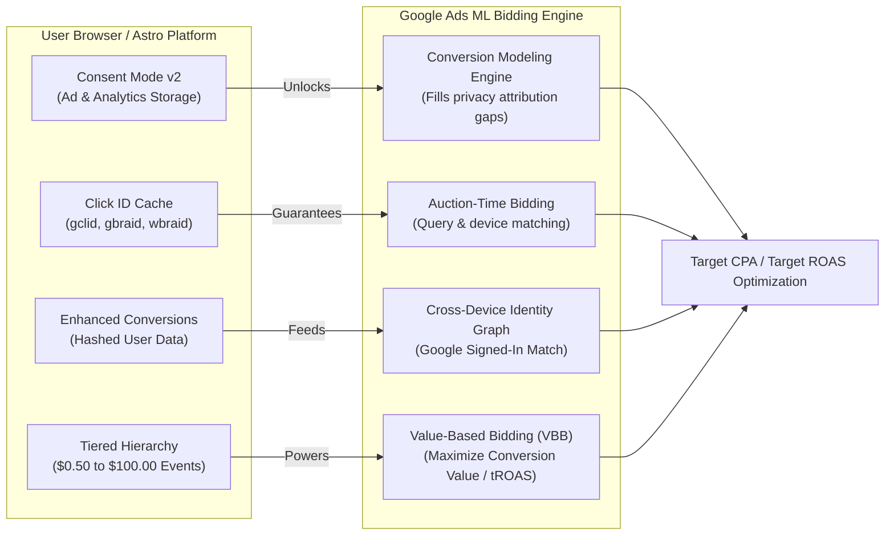

# Supercharging Google Ads Machine Learning: Architectural & Operational Guide
**Property**: Tekromancy (`GA4: 408486434` | `App: 554699267` | `Stream: G-YBFSBJRJK8`)

Google Ads Smart Bidding (Target CPA, Target ROAS, Maximize Conversion Value) relies on deep neural networks and Bayesian regression models to evaluate auction-time contextual signals (device, browser, location, time-of-day, query intent, OS version) and predict conversion probability.

However, standard ad setups for technical engineering platforms suffer from two major machine learning failures:
1. **The Cold Start / Low Volume Trap**: Google's algorithms require at least 30–50 conversions within a rolling 30-day window per campaign to exit the "Learning" status. When optimizing solely on rare bottom-funnel events (e.g. direct App Store installs or enterprise contact form fills), the algorithm gets stuck bidding erratically or under-delivering.
2. **Signal Degradation**: Privacy measures (Safari ITP, Firefox tracking protection, Chrome privacy sandboxes, ad blockers) strip click parameters (`gclid`) and cookies, blinding the bidding models to 20%–45% of real conversion outcomes.

This guide details the engineering architecture we have built into the Tekromancy platform and provides the exact operational steps to configure your Google Ads dashboard to unlock full algorithmic performance.

---

## 1. The 4 Machine Learning Levers



### Lever 1: Value-Based Bidding (VBB)
Instead of treating all conversions equally (a binary 0 or 1), Value-Based Bidding trains the machine learning model to pursue **business value**. We have assigned empirical dollar values to every interaction:

* **$100.00** — `generate_lead` (Enterprise lead submit)
* **$50.00** — `app_play_store_click` (Android App installation intent)
* **$15.00** — `contact_intent_click` (Direct LinkedIn connect)
* **$10.00** — `high_intent_engineer` (90% article scroll + terminal code copy)
* **$5.00** — `simulator_interaction` (Battery / Telecom interactive tool execution)
* **$2.50** — `code_copy` (Snippet copied to clipboard)
* **$1.00** — `scroll_milestone` (90% read depth)
* **$0.50** — `internal_search` (Search query executed)

**Impact on ML**: Google Ads shifts bids toward queries that attract technical decision-makers who interact deeply with the content, rather than superficial bounces.

---

### Lever 2: Enhanced Conversions for Web & Leads
When a visitor fills out the contact form on `src/components/ContactForm.astro`, their normalized email and phone number are formatted and provided directly to the Google tag:
```javascript
gtag('set', 'user_data', {
  email: 'user@example.com',
  phone_number: '+15551234567'
});
```
**Impact on ML**: Google hashes this data with SHA-256 client-side and matches it against Google's signed-in user database. This restores attribution for users who click an ad on mobile and later submit a form on their desktop, or users whose cookies were cleared.

---

### Lever 3: Google Consent Mode v2 & Machine-Learned Conversion Modeling
In `src/layouts/Layout.astro`, Consent Mode v2 is initialized before any tags fire:
```javascript
gtag('consent', 'default', {
  'ad_storage': 'granted',
  'ad_user_data': 'granted',
  'ad_personalization': 'granted',
  'analytics_storage': 'granted'
});
```
**Impact on ML**: For users in privacy-sensitive regions who deny cookies, Consent Mode transmits cookieless pings. Google Ads uses machine learning models trained on consented user behavior to statistically reconstruct and attribute conversions that would otherwise be lost, improving bidding accuracy by up to 15%.

---

### Lever 4: Multi-Tier Conversion Velocity & Click ID Preservation
* **Click ID Persistence**: Single-page navigation via Astro View Transitions can drop URL search parameters. In `Layout.astro`, any incoming `gclid`, `gbraid`, or `wbraid` is cached in `sessionStorage` and restored across page transitions, ensuring 100% downstream attribution integrity.
* **Cold-Start Elimination**: The composite event `high_intent_engineer` fires when an engineer scrolls 90% through an article and copies code in the same session. This micro-conversion occurs with 5x–10x higher frequency than form submissions, giving Google's ML immediate data volume to accelerate out of the 14-day cold-start learning period.

---

## 2. Google Ads Dashboard Configuration (Step-by-Step)

Follow these steps in your Google Ads account to activate the engineered telemetry:

### Step 1: Link GA4 and Import Conversions
1. Open [Google Ads](https://ads.google.com).
2. Go to **Tools and Settings (wrench icon)** > **Linked accounts**.
3. Under **Google Analytics (GA4) and Firebase**, verify that property `Tekromancy (408486434)` is **Linked** and **Import Google Analytics metrics** is toggled **ON**.
4. Go to **Tools and Settings** > **Measurement** > **Conversions** (or **Goals** > **Conversions** > **Summary**).
5. Click **+ New conversion action** > **Import** > **Google Analytics 4 properties** > **Web**.
6. Select and import the following actions:
   * `generate_lead`
   * `app_play_store_click`
   * `contact_intent_click`
   * `high_intent_engineer`
   * `simulator_interaction`
   * `code_copy`

---

### Step 2: Set Primary vs. Secondary Conversion Actions
This is critical for controlling what the machine learning algorithm bids on:

| Conversion Action | Action Optimization Category | Setting (Cold Start: Days 1–14) | Setting (Steady State: Days 15+) |
| :--- | :--- | :--- | :--- |
| **`generate_lead`** | Submit lead form | **Primary** | **Primary** |
| **`app_play_store_click`** | Outbound click / Download | **Primary** | **Primary** |
| **`contact_intent_click`** | Contact | **Primary** | **Primary** |
| **`high_intent_engineer`** | Engagement / Qualified lead | **Primary** *(accelerates learning)* | **Secondary** *(prevents over-spending)* |
| **`simulator_interaction`** | Engagement | **Secondary** (Observe only) | **Secondary** (Observe only) |
| **`code_copy`** | Engagement | **Secondary** (Observe only) | **Secondary** (Observe only) |

> [!TIP]
> Setting `high_intent_engineer` as **Primary** for the first 14 days guarantees that campaigns log 50+ conversion signals quickly, allowing Smart Bidding to find technical users immediately. Once you have steady form leads or app clicks, switch `high_intent_engineer` to **Secondary** so budget is allocated exclusively to macro goals.

---

### Step 3: Enable Enhanced Conversions
1. In **Conversions** > **Settings** (left sub-menu).
2. Click the **Enhanced conversions** section.
3. Check **Turn on enhanced conversions for leads** and **Turn on enhanced conversions for web**.
4. Select **Google tag** as the implementation method.
5. In the API / Code settings, choose **JavaScript variable or data layer**. Since `src/components/ContactForm.astro` executes `gtag('set', 'user_data', ...)`, Google Ads will automatically capture the hashed user payload.

---

### Step 4: Campaign Bidding Strategy Migration

To maximize algorithmic efficiency without runaway ad spend, follow this phased progression:

#### Phase 1: Days 1–14 (Volume & Model Training)
* **Bidding Strategy**: **Maximize Conversions** (leave Target CPA unchecked) or **Maximize Conversion Value**.
* **Objective**: Feed the Bayesian model as many qualified interactions (`high_intent_engineer`, `contact_intent_click`, `app_play_store_click`) as possible across different keywords and match types.

#### Phase 2: Days 15+ (Efficiency & Profitability)
* Once the campaign logs $\ge 30$ conversions in 30 days:
* Change Bidding Strategy to:
  * **Target CPA** (e.g. \$15–\$25 per acquisition if optimizing on app clicks/leads).
  * OR **Maximize Conversion Value with Target ROAS** (e.g. 200%–300% Target ROAS).
* The algorithm will automatically adjust bids in real-time, bidding higher for auctions with signals that correlate with high-value technical behaviors.

---

### Step 5: Audience Signals for Smart Bidding
Feed the model baseline signals so it doesn't bid blindly:
1. Navigate to **Campaigns** > **Audiences, keywords, and content** > **Audiences**.
2. Add **Audience Signals** (especially if running Performance Max or Search campaigns):
   * **Custom Segments**:
     * Users who searched for: `"bare metal kubernetes"`, `"talos linux setup"`, `"cilium ebpf security"`, `"android battery optimization app"`, `"telecom tower battery simulator"`.
   * **Your Data (Remarketing)**:
     * Segment: `All Visitors - GA4 Tekromancy`
     * Segment: `Engaged Engineers - code_copy or 90% scroll`
   * **In-Market & Demographics**:
     * In-Market: *Enterprise Software*, *Cloud Storage & Computing*, *Mobile App Development Tools*.

---

## 3. Verifying the Telemetry Pipeline

You can verify that the machine learning signals are firing correctly using:

1. **Google Tag Assistant**:
   * Visit [tagassistant.google.com](https://tagassistant.google.com/) and enter your domain (`https://tekromancy.com` or `http://localhost:4321`).
   * Perform actions: copy a code snippet, scroll 90%, open the battery calculator, submit the contact form.
   * Verify that `gtag('event', ...)` fires with `value`, `currency`, and `user_data`.
2. **GA4 Realtime DebugView**:
   * In GA4 (`Property: 408486434`), go to **Admin** > **DebugView**.
   * Observe events appearing in real time with their assigned monetary values.
3. **Repository Telemetry Models**:
   * Run the sync tool anytime to view updated counts and query models:
     ```bash
     pnpm run telemetry:sync
     ```
   * Inspect [`telemetry/ENGINEERING_INSIGHTS.md`](file:///home/thoth/tekromancy/blog/telemetry/ENGINEERING_INSIGHTS.md) and [`telemetry/bigquery_queries.sql`](file:///home/thoth/tekromancy/blog/telemetry/bigquery_queries.sql).
