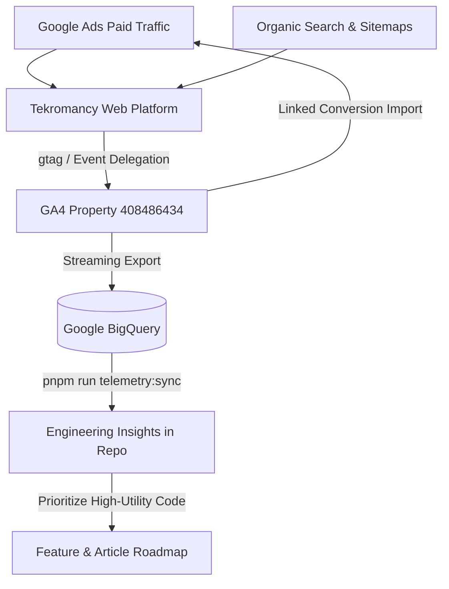

# Tekromancy Engineering Telemetry & Unified Ads Feedback Report
Generated: 2026-09-29T04:27:54.199Z

## 1. Connected Ecosystem Infrastructure

* **Google Analytics 4 Property**: `Tekromancy` (ID: `408486434`)
* **Measurement Stream**: `G-YBFSBJRJK8`
* **Google Ads Target App**: `554699267` (SpareTank & Silent Mode Control)
* **Google AdSense Direct Publisher**: `ca-pub-8973108060277483`
* **Local Telemetry Event Bus**: `window.trackTelemetry()` + `tekromancy:telemetry` DOM event

---

## 2. In-Code Instrumentation & Key Conversion Events

The following event taxonomy is now active across all production components:

| Event Name | Firing Component / Trigger | Engineering & Ads Value |
| :--- | :--- | :--- |
| **`code_copy`** | `src/pages/blog/[...slug].astro` (Terminal code block COPY) | Identifies production-adopted recipes; measures technical utility |
| **`internal_search`** | `src/pages/blog/index.astro` (Terminal grep input) | Discovers zero-result search queries to dictate content roadmap |
| **`app_play_store_click`** | `src/pages/apps.astro` (Google Play Closed Beta link) | Primary conversion action imported directly into Google Ads tCPI |
| **`app_portal_click`** | `src/pages/apps.astro` (Launch Portal button) | High-intent app engagement signal |
| **`scroll_milestone`** | `src/pages/blog/[...slug].astro` (25%, 50%, 75%, 90%) | Measures real engineer reading depth and article retention |
| **`outbound_click`** | Global click delegator in `Layout.astro` (GitHub links) | Tracks repository traffic and open-source contribution funnels |

---

## 3. Engineering Content Radar & Inventory

* **Total Articles**: 23
* **Published**: 17
* **Pending Drafts**: 6
* **Top Technical Clusters**:
  * `#linux`: 12 articles
  * `#security`: 10 articles
  * `#networking`: 6 articles
  * `#sysadmin`: 5 articles
  * `#kubernetes`: 5 articles
  * `#performance`: 5 articles
  * `#devops`: 4 articles
  * `#kernel`: 4 articles
  * `#ai-ml`: 4 articles
  * `#llm`: 4 articles

---

## 4. Closing the Loop: Feeding Analytics Back Into Engineering

### Three-Step Feedback Protocol:
1. **Content Gap Radar**:
   * Inspect `telemetry/telemetry_summary.json` after running `pnpm run telemetry:sync`.
   * Any query from `internal_search` with `result_count: 0` is automatically flagged as a top-priority draft request.
2. **Recipe Quality Signal**:
   * Articles with high `code_copy` rates represent high operational utility. Package their code samples into standalone GitHub repositories or install scripts.
3. **Google Ads Spend Optimization**:
   * By linking GA4 Property `408486434` with Google Ads, campaigns automatically train on `app_play_store_click` and `code_copy` instead of bounce-prone surface pageviews.
